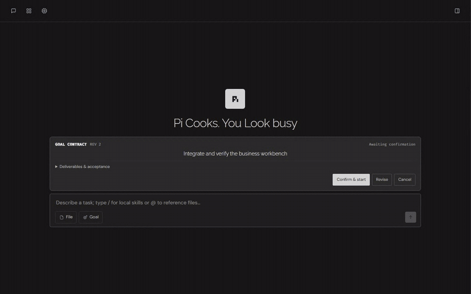
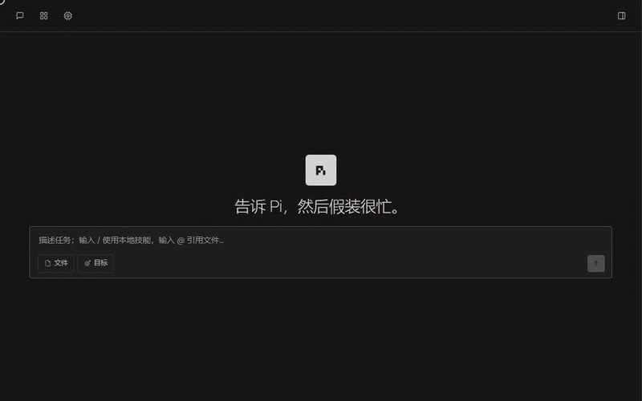
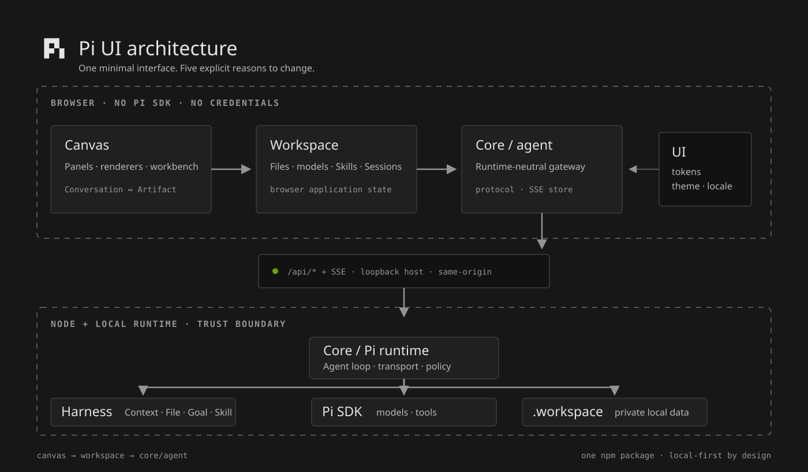

<div align="center">

# Pi UI

**Minimal interface. Serious agent work.**

A local-first, business-adaptable workspace for Pi agents.<br />
Bring your own brand, language, Harness, and Skills—without weakening the runtime boundary.

[](https://www.npmjs.com/package/@whyj/pi-ui)


[Highlights](#why-pi-ui) · [Design principles](#restraint-means-appearing-only-when-needed) · [Quickstart](#running-in-two-minutes) · [Architecture](#one-package-five-explicit-boundaries) · [HTML deck](./docs/slides/index.html)

</div>

<p align="center">
  
</p>

<p align="center"><sub>Conversation preserves context. Canvas handles inspection and editing. Every linkage is triggered by an explicit user action.</sub></p>

## One minimal UI. A workspace your business can define.

Pi UI is neither an overloaded chat window nor a product screen coupled directly to the Pi SDK. It is a quiet desktop workbench with one strict boundary: the browser talks only to the `core/agent` gateway, while Node Core owns the Pi SDK, credentials, and local filesystem.

Your product adapts the experience through stable contracts:

| Layer | Your product defines | Pi UI preserves |
| --- | --- | --- |
| Brand and visual language | `dark`, `zengrid`, or `aida`; brand; locale; complete semantic tokens | One component model, interaction contract, and accessibility baseline |
| Agent constraints | Context, File, Goal, and Skill Harnesses | Replaceable, testable authorization, persistence, audit, and completion checks |
| Business capabilities | Workspace Skills and controlled `skill_package` flows | Local-first discovery, lazy expansion, validation before contribution, no implicit overwrite |
| Artifact experience | Canvas renderers and the Workspace facade | One safe data path across conversations, files, trajectories, and artifacts |

The result is a UI foundation that can live inside different products without giving up its architecture, accessibility, or Pi identity.

## Why Pi UI

### 01 · Harness turns “please do the right thing” into a verifiable contract

<p align="center">
  
</p>

A complex task does not start merely because someone types `/goal`. Goal Harness first persists a UserIntent and Goal Contract. Core permits goal creation only after the user confirms the exact `intentId + revision + contractHash`. Completion then passes through a structured audit covering every agreed deliverable, acceptance criterion, constraint, non-goal, and verification step.

- **Context Harness** keeps a stable context prefix, deterministic Tool/Skill ordering, and cache-usage evidence.
- **File Harness** provides browser-safe file access, Session isolation, and controlled write boundaries.
- **Goal Harness** aligns intent before execution and keeps background Goals independent from foreground navigation.
- **Skill Harness** generates and validates a Session-local candidate before it can enter the Workspace Skill root.

### 02 · Follow on the left. Inspect on the right.

Conversation follows the run: ordinary Sessions show a compact trajectory, while Goal Sessions let process recede and results lead. Canvas inspects raw Tool input/output, opens artifacts, previews files, and provides an explicit fullscreen focus mode.

The two sides share context without secretly synchronizing:

- Click a trajectory step to read its latest raw input and output in Canvas.
- Click a final artifact to open the matching renderer.
- Start at a balanced 50/50 split; persist user resizing; let `Esc` exit fullscreen without closing the preview.
- Abort old downloads and clear transient state when switching Sessions, so late responses cannot pollute the new Session.

Both “what the agent did” and “what the artifact is now” remain visible, inspectable, and ready for continued work.

### 03 · Skill Hub is a capability pipeline, not a marketplace pop-up

<p align="center">
  
</p>

Skill Hub manages only the current Workspace's local Skills. Catalog reads stay lightweight, full packages load only when opened, and dependency environments are fingerprinted and reused at Workspace scope instead of being copied into every Session.

A strong Agent turn can become a reusable Skill, but the path is deliberately staged:

`Completed turn → Session draft → @SKILL.md validation turn → Name discussion + skill_package`

There is no copied chain of thought, no unconfirmed publishing, and no browser-side remote installation endpoint. Capabilities become reusable without bypassing the trust boundary.

## Restraint means appearing only when needed

Pi UI's primary design principle is **progressive disclosure**: the user chooses the depth; the interface does not compete for attention.

- Workspace begins collapsed and opens only through an artifact, trajectory, or explicit panel action.
- Raw Tool input/output never floods Conversation; detailed run evidence belongs in Canvas.
- Secondary answer actions sit behind one hover/focus `···`; compact metrics read `TTFT · TPOT · TPS · IN · OUT · CACHE`.
- Flat hierarchy uses backgrounds, borders, and spacing—not decorative shadows or glow.
- Ordinary feedback stays below 300ms and uses interruptible `transform`/`opacity` transitions with complete `prefers-reduced-motion` support.
- The product is desktop-only; browser zoom preserves the same fluid two-column model instead of turning it into a mobile drawer.

These are product decisions, not missing features: content leads, structure recedes, and every persistent animation must correspond to real running work.

## Running in two minutes

Node.js 20 or newer is required. No global installation is necessary:

```bash
cd /path/to/your-project
npx --yes @whyj/pi-ui@latest install
```

`install` creates an ignored `.workspace/`, starts the UI and Core API, and opens `http://127.0.0.1:4173`. Press `Ctrl+C` to stop.

For regular use, install the CLI:

```bash
npm install --global @whyj/pi-ui
piUi install
piUi doctor
```

If Pi already exists on the machine, first launch can inherit models, authentication, and historical Sessions from `~/.pi/agent`. Continuing a historical Session creates an application-owned private fork and never rewrites the source JSONL.

### Common commands

```bash
piUi start                           # Start again
piUi doctor --json                   # Machine-readable diagnostics
piUi start --cwd ./work --port 4317  # Choose Workspace and port
piUi --help
```

### Define theme, locale, and brand at deployment time

Startup configuration is injected before React mounts. It does not require a rebuild and is not stored in browser localStorage:

```powershell
$env:PI_UI_THEME = 'dark'       # dark (default), zengrid, or aida
$env:PI_UI_LANGUAGE = 'en'      # en (default), zh, or zh-CN
$env:PI_UI_BRAND = 'pi'         # pi or aida
piUi start
```

Build and run from source:

```bash
pnpm install
pnpm build
pnpm start
```

> [!IMPORTANT]
> Pi UI is currently a local desktop workbench, not a public SaaS server. Core accepts only `127.0.0.1`, `localhost`, or `::1`, and browser API calls must pass same-origin validation. Because there is no remote authentication boundary, `0.0.0.0`, LAN, and public-host listening are intentionally rejected.

## One package, five explicit boundaries

<p align="center">
  
</p>

The primary dependency directions are `canvas → workspace → core/agent`, `canvas → ui`, and `core/pi → harness`.

- `core`: Agent loop, browser gateway, protocol, Node transport, and Pi runtime.
- `harness`: replaceable Context, File, Goal, and Skill constraints with persistence.
- `ui`: semantic tokens, themes, locale, formatting, and business-state-free primitives.
- `canvas`: application panels, file/trajectory renderers, inspection, and editing.
- `workspace`: files, models, Skills, Sessions, and browser application state.

These boundaries isolate reasons to change while shipping as one `@whyj/pi-ui` package: `dist/` contains the browser UI, `dist-node/` contains Node Core, Harness, and runtime, and `bin/pi-ui.js` remains a thin CLI entry.

## Deliberate trade-offs

| We choose | We give up | Why |
| --- | --- | --- |
| Loopback-only Core + same-origin checks | Unauthenticated remote access | Credentials, Pi SDK, and filesystem stay inside the Node trust boundary |
| Explicit click-driven linkage | Automatic focus stealing and implicit synchronization | Users always know why Canvas changed |
| Progressive disclosure | Permanent toolbars, badges, and metric walls | Long-running Agent work needs a low cognitive load |
| Desktop-only with zoom support | Phone, touch, and mobile-drawer layouts | Preserve one dense, predictable two-column work model |
| Local Skill Hub with validation before contribution | Built-in remote marketplace and one-click publish | Reusable capability must not bypass review and naming confirmation |
| One npm package | Five independently versioned packages | Module boundaries should not transfer integration complexity to adopters |

Read the full rationale in [Architecture](./docs/ARCHITECTURE.md), [UX Principles](./docs/UX.md), and [Design System](./docs/DESIGN.md). The same story is available as a browser-native [Pi UI HTML deck](./docs/slides/index.html).

## Development and verification

Use pnpm on Windows to avoid exceeding dependency path limits in the Pi SDK:

```bash
pnpm install
pnpm dev
pnpm typecheck
pnpm test:modules
pnpm test:canvas
pnpm test:e2e
pnpm build
```

Runtime data belongs only in `.workspace/`. Never commit `.env`, API keys, generated runtime data, or Workspace contents, and never expose provider credentials through a `VITE_*` variable.

---

<div align="center">

**Pi Cooks. You Look busy.**

</div>
