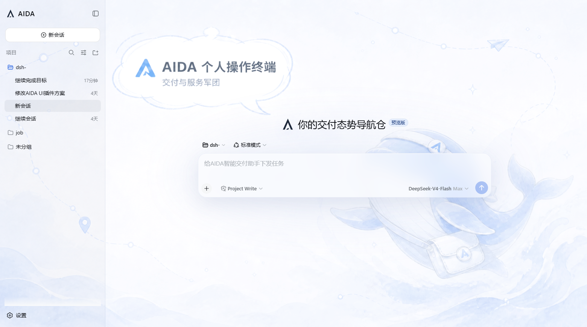

# @aida/aida-ui-dsh

English | [中文](README.zh.md)



## Standard DSH Plugin Installation

This repository distributes AIDA as a **prebuilt npm archive**, not as an npm Registry release. Install the `.tgz` through the DSH profile command so DSH can record the dependency and activate the package's `dsh.bundle.patch` layer. Do not use `npm install`, do not run `npm publish`, and do not edit the generated profile `package.json` or Cordis composition by hand.

### Naming contract

| Item | Value |
| --- | --- |
| Package name | `@aida/aida-ui-dsh` |
| DSH bundle id | `ui-aida` |
| Target profile | `web` |
| Archive version | `0.1.0-rc.10` |
| Archive file | `aida-aida-ui-dsh-0.1.0-rc.10.tgz` |
| Release branch | `aida-dsh` |

### Human installation

Prerequisites: the `dsh` CLI and `pnpm` must be available on `PATH`, and the target DSH Web build must provide the Workspace APIs required by AIDA Canvas.

1. Download [`aida-aida-ui-dsh-0.1.0-rc.10.tgz`](https://github.com/yangjingo/pi-Ui/raw/refs/heads/aida-dsh/releases/aida-aida-ui-dsh-0.1.0-rc.10.tgz).
2. Verify the archive before installation.

```text
SHA-256  45B6D4836DF30A1CB4AC8F585CFC6FC77B8ADBDB5FAB1D72B135CA17550F1BE2
```

PowerShell:

```powershell
(Get-FileHash .\aida-aida-ui-dsh-0.1.0-rc.10.tgz -Algorithm SHA256).Hash
```

POSIX shell:

```sh
echo "45B6D4836DF30A1CB4AC8F585CFC6FC77B8ADBDB5FAB1D72B135CA17550F1BE2  aida-aida-ui-dsh-0.1.0-rc.10.tgz" | sha256sum -c -
```

3. Install the archive into the standard DSH Web profile.

```sh
dsh plugin --profile web add ./aida-aida-ui-dsh-0.1.0-rc.10.tgz
```

4. Restart the Web profile.

```sh
dsh web
```

5. Open **Settings → Plugins → Plugin list** and confirm that `ui-aida` / `@aida/aida-ui-dsh` is active. A new session should show the AIDA personal-terminal surface and the Canvas entry.

To inspect why the package is installed:

```sh
dsh plugin --profile web why @aida/aida-ui-dsh
```

To remove the plugin without deleting sessions or project files:

```sh
dsh plugin --profile web remove @aida/aida-ui-dsh
```

### Agent installation protocol

An automation agent installing this plugin must follow the same profile-bundle boundary as a human operator:

1. Resolve the downloaded `.tgz` to an absolute local path.
2. Calculate SHA-256 and require an exact match with the value above.
3. Run `dsh plugin --profile web add <absolute-tarball-path>` from the user's normal shell.
4. Never unpack files into the DSH source tree, never edit `$DSH_HOME/profiles/web/package.json`, and never append `cordis.patch.yml` rows manually.
5. Restart the `web` profile after installation.
6. Confirm the dependency with `dsh plugin --profile web why @aida/aida-ui-dsh`, then verify `ui-aida` in the Plugin list.
7. Report the installed package name, archive version, checksum, profile, and verification result to the human operator.

For local plugin development, install the checkout itself instead of the archive:

```sh
cd /path/to/aida-ui-dsh
dsh plugin --profile web add .
```

Design and maintenance references: [AIDA UI design language](docs/design-language.md), [integration documentation](docs/README.md), and [agent guidance](AGENTS.md). UI changes are governed by the repository-local TASTE and Amicro skills, adapted to DSH's native primitives and semantic tokens.

AIDA is a browser-only deployment skin plus Canvas for the dsh Web client. The main interface keeps PIUI's existing new-session layout, replaces the expanded and collapsed sidebar artwork with one AIDA logo through `sidebar.brand` and `sidebar.mark`, and replaces the new-session brand lockup through `conversation.hero.brand` with `Logo | AIDA`, the `DELIVERY INTELLIGENCE` descriptor, the localized project-delivery slogan, and the Preview label. It changes presentation only: agent composition, tools, prompts, session behavior, and durable data remain untouched.

The visual identity uses the supplied `assets/brand-logo-light.svg` on light surfaces and `assets/brand-logo.svg` on dark surfaces. The sidebar renders only that symbol. The new-session Banner places the symbol beside an AIDA identity block, separated by a fine rule; `DELIVERY INTELLIGENCE` sits under the AIDA name, with the localized project-delivery slogan and compact Preview pill below the lockup. `assets/aida-wordmark.svg` remains the supplied source artwork, while the responsive Banner composes its live text for localization and narrow-view adaptation. The wider AIDA palette continues to use semantic `--dsw-*` variables owned by `theme.ts`.

When a Session opens its initial history page, the plugin replaces the conversation package's plain loading-text fallback with a centered two-rail circular signal. The outer and inner rails counter-rotate in the active AIDA brand color, retain the localized `Loading history…` status, and become static under `prefers-reduced-motion: reduce`; removing the plugin restores the conversation fallback.

The plugin stacks its brand-token layer over the selected light, dark, or system theme, so the existing Appearance preference stays functional. Removing the `ui-aida` client entry reverses the token, locale, and slot registrations and restores the neutral PIUI sidebar artwork. The generic shells retain all interaction behavior: sidebar collapse and expansion, New Session, Workspace selection, and composer behavior are not replaced.

## AIDA Canvas

On AIDA deployments a Canvas toggle appears in the session header's utilities row (beside the session-log export) — an icon-only button matching the sidebar's logo-row panel toggle (28px circular, tooltip/aria label; no text label) carrying the first-version Canvas mark: a rounded square ring around a 2×2 grid of small squares, in the icon set's rounded style. It opens the Canvas as the frame's **right-hand details track** — a true side-by-side column: the conversation reflows (never occluded), the column is drag-resizable with **no fixed maximum width** (the center-column floor bounds it on narrow viewports), and closing it restores the layout. A header **fullscreen icon at the top right** expands the Canvas to fill the whole conversation area — the frame grid collapses the center track to zero, so the conversation **truly shrinks** (it is never merely covered), window resizes recompute the override so the Canvas keeps filling the rest, and the flipped icon restores the three-column layout. The column occupies the `details` seat (a lower shadowing priority than the built-in tool-details panel), ported from the Pi Canvas feature set:

- **Files** — the session workspace's recursive file tree (skipping hidden and tooling entries), with search, per-row rename/delete, Ctrl/⌘+click and Shift+click multi-selection (batch open/mention/delete), right-click row menus, in-tree drag-and-drop moves (the `host.moveFile` verb), drag-and-drop import, and file/folder pickers.
- **Canvas** — open file tabs with format-aware rendering and editing:
  - **Markdown** (`.md`/`.markdown`) renders as a formatted GFM document (the shared `MarkdownText` renderer, syntax-highlighted code fences); clicking 编辑 switches to the source textarea and Ctrl/⌘+S saves through the host.
  - **HTML** (`.html`/`.htm`) renders in a sandboxed `allow-scripts` iframe; the same 编辑 toggle edits the source.
  - **Mermaid** (`.mmd`/`.mermaid`) renders the diagram through a lazily loaded mermaid runtime (kept out of the main bundle); broken diagrams fall back to the source with the failure message.
  - **SVG** (`.svg`) previews as the rendered image (the host classifies it as an image, so the read arrives as base64); the same 编辑 toggle edits the decoded UTF-8 source, and saving writes the text back and refreshes the rendered image in place.
  - **JSON** (`.json`/`.jsonl`) renders as the shared collapsible `JsonTree` (per-node copy actions with localized labels); content that cannot render as a tree falls back to the raw text with an error note.
  - **CSV/TSV** (`.csv`/`.tsv`) renders as a table with RFC-4180 quoting.
  - **Source code** (`.py`, `.ts`/`.js`, `.rs`, `.go`, `.css`, `.xml`, and more) renders through the shared shiki `CodeBlock` with extension-derived syntax highlighting and a copy button.
  - Other text files use the plain text pane, and image, PDF, Office (extracted text/sheet preview), and binary download previews round out the surface.
- **Trajectory** — the trajectory surface: the center-column trajectory view is hidden (AIDA chrome), and this tab renders the **full original ui-trajectory view** inside the Canvas — the toolbar (turns/calls/input/model/tools), the timeline, and the record table with JSON payloads; clicking a record expands its input and output inline. The canvas renders it through the shared `conversation.view` seat (`renderSlot` with `only: 'trajectory'`); when ui-trajectory is absent, the tab falls back to its own **turn/call ledger** folded from the session snapshot — each turn header ("第 N 回合") groups its tool calls, headers collapse/expand their runs, and clicking a call opens its detail (args + output + produced files) with the back navigation. The toolbar carries the **会话日志 / Session log** download button (wired to the `sessionLogDownload` service); the tab order is 文件 / 轨迹 / 画布 with per-tab counts. The call detail is the merged tool-details view: the column shadows the built-in details panel, so tool inspection happens here, and clicking a tool row in the chat opens the column.
- **Linkage** — the header toggle opens the column, the produced-files chips under each closing assistant message open in the Canvas instead of the Host OS opener, and the panel's ✕ closes it. The canvas column, the toggle, and the chips share one per-session store; column open/close is the frame's details-track state (`ctx.layout`).
- **@-mention into the composer** — the project files are a composer `@` reference source (menu group 文件, listed above the built-in subagent source): typing `@` shows the session's text files and a pick inserts a `@path` chip whose model form embeds the file content at submit. The Files row action **引用到输入框** inserts the same chip for the selected file, and the Canvas preview's **引用** button quotes the current selection (the edit-area textarea selection, or the rendered preview's selection) as a blockquote labeled with its source path — falling back to a whole-file chip when there is no selection. A consecutive mention of the same file with no draft change in between is deduplicated (the second insert is a no-op). Picks and injections route through the conversation service's per-session input shell, so the column never touches the composer's machine directly.

The Canvas reads files through six loopback-pinned host methods (`host.listFiles`, `host.readFile`, `host.writeFile`, `host.renameFile`, `host.moveFile`, `host.deleteFile`) exposed on the runtime `IWorkspaces` face. The host accepts only roots in the Workspace registry, then canonicalizes every target and rejects escapes; a browser request cannot name an arbitrary host directory. A session change aborts in-flight list/read/upload requests and clears browser-local progress before the new Workspace tree renders. Trajectory and conversation facts come from the session snapshot, so they add no wire methods. Removing the `ui-aida` entry withdraws the column, toggle, and chips; the built-in tool-details panel resumes the `details` seat, the center-column trajectory view and the header download button return, and every other component returns to the neutral UI.

## AIDA chrome modifications

Beyond the brand artwork and the Canvas, the AIDA deployment adjusts two small chrome details (both reversible by removing the `ui-aida` entry; see `src/client/skin/chrome.ts`):

- **The trajectory surface and the session-log download live in the Canvas.** The center-column trajectory view — the whole view-ring tab nav (a lone Chat tab once the trajectory tab is gone, so it is removed entirely) and the mounted view — is hidden, and the session header's "Session log" export button (registered by `dsh-session-log-export` into `conversation.session.header.utilities`, matched by label so the Canvas toggle sharing the seat stays) is hidden too. The Canvas trajectory tab renders the trajectory and hosts the download button (React-owned, wired to the `sessionLogDownload` service). React-owned nodes are never moved: hidden nodes stay mounted behind a display toggle.
- **The workspace vocabulary reads "Project".** In the sidebar workspace region (`sidebar.workspaces`) and the new-session workspace picker (`conversation.hero.workspace`), the labels "Workspaces"/"工作区" render as "Projects"/"项目" (also "Add workspace"/"添加工作区" → "Add project"/"添加项目" and the equivalent aria-label/title/placeholder attributes). Text is rewritten in place by the same observer, so React re-renders with unchanged copy keep the Project wording; the underlying data model, RPC methods, and settings names still say "Workspace". The Canvas copy follows the same vocabulary ("search project files", "this session has no project").

## AIDA intranet models

The plugin ships a settings section **内网模型 / Intranet models** with a curated set of intranet-deployed model presets — Ollama, vLLM, One API / New API gateways, and LM Studio — each an OpenAI-compatible provider profile (protocol `openai-completions`, a default loopback endpoint, and a default model list). One click installs a preset into the `llm-pi-ai` settings namespace at `providers.<route>` — the same `settings.mutate` the Models page's custom-provider card performs — after which the provider and its models appear in the composer model picker. Endpoints default to loopback (`127.0.0.1`); after install, the Models page edits the endpoint and model list for the actual intranet host, and a gateway that needs a key gets it through the Models page's credential field. The install writes are revision-guarded, so a route another surface declared meanwhile is refused instead of overwritten; the section is reversible by removing the `ui-aida` entry (installed providers remain in settings until deleted from the Models page).

## Plugin Library Entry

This package is the reusable DSH plugin-library unit for the AIDA identity and Canvas. Its manifest declares both the browser plugin and an installable `dsh.bundle` layer; installing the package adds this Cordis entry as one removable unit:

```yaml
- id: ui-aida
  name: '@aida/aida-ui-dsh'
```

Install a built tarball or the local checkout through the DSH plugin command; the CLI adds this package to the selected profile's bundle stack:

```sh
dsh plugin --profile web add ./releases/aida-aida-ui-dsh-0.1.0-rc.10.tgz
dsh plugin --profile web add .
```

The active deployment lists `ui-aida` under **Settings → Plugins → Plugin list**. `dsh plugin --profile web remove @aida/aida-ui-dsh` removes the bundle row and browser contribution without changing stored sessions or model-provider settings installed through the Intranet models section. The archive requires a matching DSH Web build that provides the five Workspace file methods described above.

## Model Experience

Indirectly, through Workspace-file references inserted by the Canvas: an `@path` reference embeds capped file content into the submitted prompt, and a quoted selection inserts its literal text as a source-labeled blockquote; no other AIDA copy or Canvas state reaches a model request.

#### KV Cache effect

None; the plugin does not assemble provider input.

## Known Limitations and Deferred Work

- **Dark mode keeps the neutral surface palette** — AIDA currently adapts its identity accents rather than replacing every dark surface token.
- **Files has no multi-select ZIP action yet** — rename and delete act on one row at a time; Pi's multi-selection archive flow is not part of this integration.
- **Office previews are text/sheet only** (no layout fidelity), and a canvas-side "locate in chat" highlight is not shipped.
- **Mentions degrade to literal `@path` text after a session remount** — like the built-in subagent references, a file mention's chip lives in the live composer state; a draft persisted across a session switch or reload keeps the clipboard text (`@path`) and submits that literal rather than re-embedding the file.
- **The tool-details takeover is text-level** — the Canvas column shadows the built-in details panel and its trajectory step detail shows args, output text, and produced files, but the per-tool card renderers (terminal, code viewers) do not move into the column; clicking a tool row opens the column without auto-selecting that step in the trajectory.
- **The center-column trajectory view is hidden** — the Canvas trajectory tab is the trajectory surface; a tool-row "inspect" action that activates the hidden center view leaves the center column blank (the Canvas trajectory tab is one click away).
