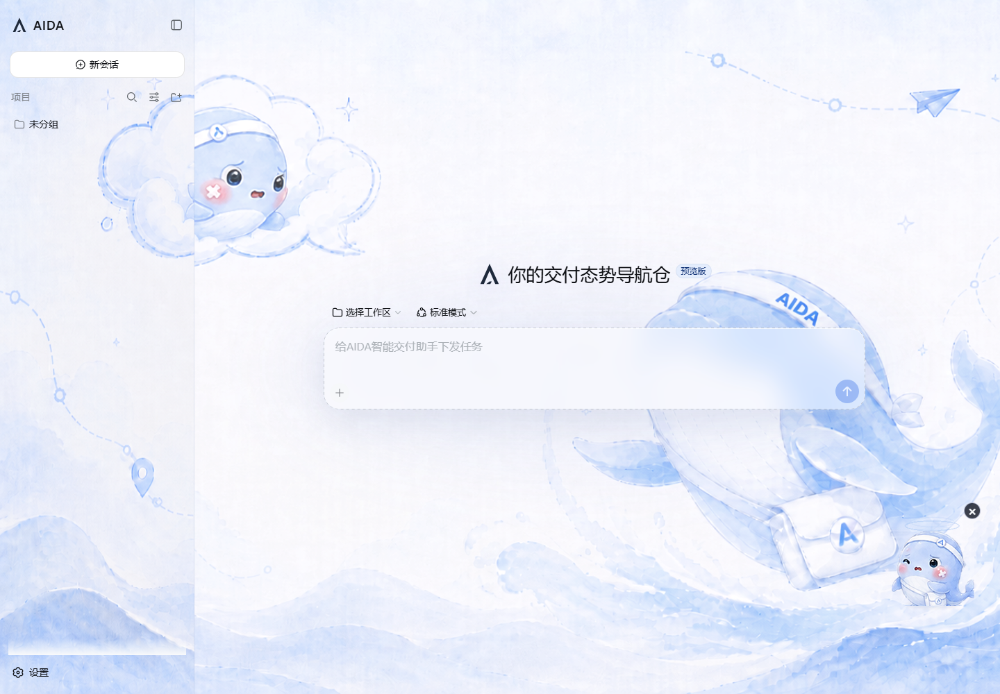

# AIDA UI 视觉实现

本文记录 AIDA UI 当前版本在 DSH Web 中的背景嵌入与毛玻璃实现。它是
[设计语言](./design-language.md)的工程补充：设计语言定义视觉原则，本文定义背景资产、
CSS 层级和可调整参数。

## 1. 当前视觉结构

当前界面不是把背景图直接设置在每个面板上，而是分成四层：

1. `body` 使用 DSH 的 `--dsw-alias-bg-base`，作为图片未加载和深色主题下的安全底色。
2. 应用根框架的 `::before` 铺设一张全视口 V2 背景。
3. 会话滚动区和内容承载层变为透明，让背景能够透出。
4. 会话卡片与侧栏使用半透明语义色和 `backdrop-filter`，形成克制的毛玻璃表面。

背景图的视觉主体位于画面左上和右下，中部保持低对比留白，避免影响会话正文和输入区域。
CSS 使用 `cover` 适配桌面窗口，因此缩放时允许边缘裁切，不改变项目的双栏桌面布局。



## 2. 背景资产与部署路径

- V2 原始资产：`assets/aida-background-v2.png`
- 插件正式资产：`assets/aida-background.png`
- 浏览器 URL：`/aida-background.png?v=2`
- 当前尺寸：`1672 × 941`

代码始终引用稳定文件名 `aida-background.png`；查询参数 `v=2` 只用于缓存失效。这样升级背景时
不需要改变 DSH 静态资源路由，同时浏览器也不会继续显示 V1 缓存。

本地集成由 `scripts/precommit.ps1` 完成两处同步：

- `apps/web/public/aida-background.png`：供下一次 Vite 构建复制。
- `apps/web/dist/aida-background.png`：当生产预览已经运行时立即刷新现有构建产物。

插件包自身也通过 `package.json` 的 `files` 字段包含 `assets/*.png`。发布包拥有图片资产，
但 DSH Web 的根路径静态文件仍必须由宿主的 `public`/`dist` 提供。

## 3. 全视口背景嵌入

实现位于 `src/client/AidaBrand.module.css`。CSS Module 中使用 `:global(...)` 接管 DSH 宿主，
避免选择器被模块哈希隔离。

```css
:global(body) {
  background-color: var(--dsw-alias-bg-base);
}

:global(#root > div > div::before) {
  content: '';
  position: absolute;
  inset: 0;
  pointer-events: none;
  background: url('/aida-background.png?v=2') center / cover no-repeat;
  filter: contrast(1.06) saturate(0.92);
  opacity: 0.76;
}
```

关键点：

- `::before` 属于应用根框架，不创建额外 React 节点，也不改变 DSH 布局结构。
- `position: absolute` 与 `inset: 0` 让图片覆盖整个框架。
- `pointer-events: none` 保证背景永远不会拦截点击、拖拽或文本选择。
- `cover` 保持图片比例并填满视口；`center` 让不同桌面宽度下的裁切保持均衡。
- `opacity` 控制图片存在感，`contrast`/`saturate` 只做轻量统一，不改变原图色相。
- 根框架仍保留语义背景色，所以图片请求失败时不会出现透明或白屏。

## 4. 中心会话区透底

毛玻璃生效的前提是玻璃表面后面确实存在可见像素。中心列原有的多层实体背景会遮住
全局图片，因此当前版本只清除承载层的背景、边框和阴影：

```css
:global([class*='_centerCol'] [class*='_scrollBody']),
:global([class*='_centerCol'] [class*='_viewArea']) {
  background: transparent !important;
  border: 0 !important;
  box-shadow: none !important;
  outline: 0 !important;
}
```

这里的 `!important` 用于覆盖 DSH CSS Module 生成类的宿主样式。选择器只约束中心列的结构性
容器，不把按钮、输入框或状态表面统一透明化。

## 5. 会话卡片毛玻璃

会话卡片保留 DSH 语义表面颜色，但将其与透明通道混合，再对卡片背后的背景做模糊和饱和：

```css
:global([class*='_centerCol'] [class*='_card']) {
  background-color:
    color-mix(in srgb, var(--dsw-alias-bg-layer-1) 46%, transparent) !important;
  border-color:
    color-mix(in srgb, #789bd6 16%, rgba(255, 255, 255, 0.82)) !important;
  box-shadow:
    0 18px 48px rgba(65, 91, 138, 0.1),
    inset 0 1px 0 rgba(255, 255, 255, 0.76) !important;
  backdrop-filter: blur(18px) saturate(112%);
}
```

- `46%` 是卡片实体层比例。数值越高，文字可读性越稳定，背景透出越少。
- `blur(18px)` 控制磨砂扩散半径，不模糊卡片自身的文字和图标。
- `saturate(112%)` 补偿模糊造成的色彩损失。
- 外阴影把卡片从背景上抬起，内侧 `1px` 高光表达玻璃边缘；两者均保持低对比。

毛玻璃只用于会话等功能表面，不新增装饰性玻璃卡片，也不改变 DSH 的组件层级。

## 6. 侧栏毛玻璃与背景对齐

侧栏是独立的布局列。为了让它在自己的层叠上下文中也能采样到同一幅画面，侧栏重新引用
背景，并使用全视口尺寸与左上原点对齐：

```css
:global([class*='_sidebarCol']) {
  background-color: transparent !important;
  background-image:
    linear-gradient(rgba(248, 250, 254, 0.22), rgba(248, 250, 254, 0.22)),
    url('/aida-background.png?v=2') !important;
  background-position: left top, left top !important;
  background-repeat: no-repeat, no-repeat !important;
  background-size: 100vw 100vh, 100vw 100vh !important;
  border-right-color: rgba(108, 137, 184, 0.14) !important;
  backdrop-filter: blur(18px) saturate(106%);
}
```

第一层 `linear-gradient` 是 22% 的浅色薄膜，第二层才是背景图。`100vw 100vh` 保证侧栏看到的
不是一张缩小到侧栏宽度的图片，而是全局画面的左侧切片。侧栏内部容器继续保持透明，避免重复
叠加底色后变成不透明面板。

## 7. 深色主题

深色主题不替换另一张图片，而是降低同一背景的亮度、饱和度和透明度：

```css
:global(body[data-ds-dark-theme] #root > div > div::before) {
  filter: saturate(0.7) brightness(0.5);
  opacity: 0.24;
}
```

DSH 的 `--dsw-alias-*` token 仍负责底色和功能表面的主题切换。背景只提供氛围，不成为信息颜色，
因此焦点、错误、警告和按钮状态仍由 DSH 语义 token 控制。

## 8. 参数控制表

| 目标 | CSS 参数 | 当前值 | 调整影响 |
| --- | --- | --- | --- |
| 全局背景强度 | 根框架 `::before` 的 `opacity` | `0.76` | 越高越鲜明，也越可能干扰正文 |
| 全局背景质感 | `filter` | `contrast(1.06) saturate(0.92)` | 只做小范围校正 |
| 卡片实体度 | `color-mix` 比例 | `46%` | 越高越不透明、可读性越强 |
| 卡片磨砂 | `backdrop-filter` | `blur(18px) saturate(112%)` | 模糊越大，GPU 开销越高 |
| 侧栏浅色薄膜 | 渐变 alpha | `0.22` | 越高越接近白色实体面板 |
| 侧栏磨砂 | `backdrop-filter` | `blur(18px) saturate(106%)` | 略低于卡片饱和度以保持安静 |
| 深色背景强度 | 深色 `opacity` | `0.24` | 避免浅色插画压低深色主题对比度 |

调整时应一次只改变一组参数，并同时检查浅色、深色、1280px 以上桌面宽度和缩放压缩后的
有效视口。背景和大面积 `backdrop-filter` 不参与动画，以避免持续重绘。

## 9. 验证清单

1. `/aida-background.png?v=2` 返回 `200`，文件哈希与正式资产一致。
2. 首屏、长会话滚动区和折叠/展开侧栏时，背景没有断层或重复缩放。
3. 会话卡片文字、代码、链接和焦点环在浅色与深色主题下均清晰。
4. 背景层不拦截鼠标、文件拖放和文本选择。
5. 页面没有横向溢出，Canvas 展开和最大化仍保持原有布局。
6. 图片加载失败时，DSH 语义底色仍能完整承载界面。
