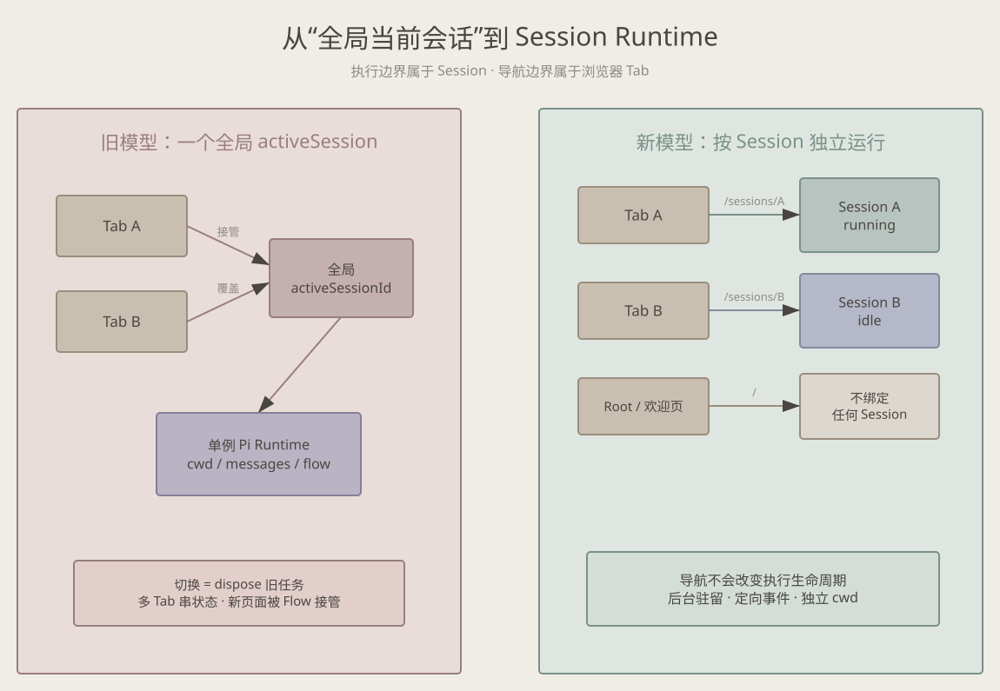
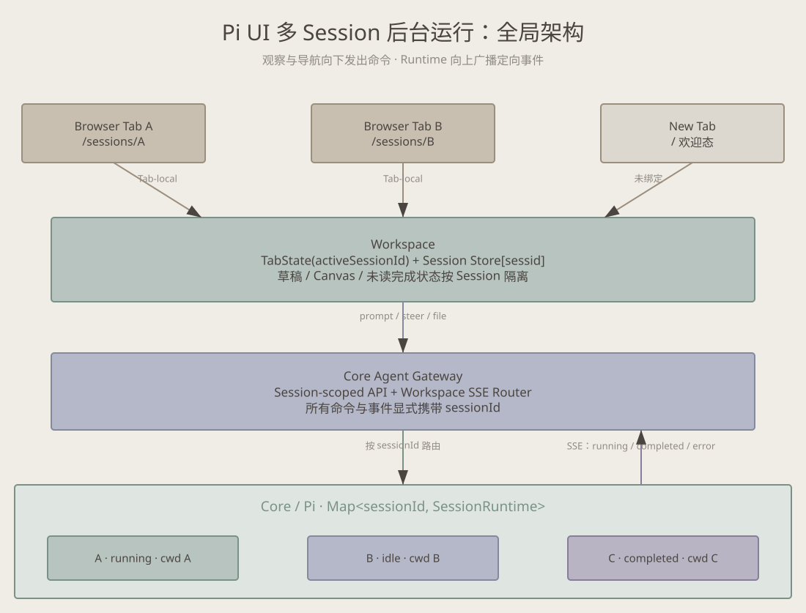

# 从“当前会话”到 Session Runtime：Pi UI 后台 Agent Flow 的架构取舍

一个聊天界面很容易产生一种错觉：系统永远只有“当前会话”。用户看到哪个会话，服务端就运行哪个会话。对普通问答这套模型勉强成立，但当 Agent Flow 能执行数分钟、操作文件并在后台完成时，“当前会话”就成了错误的抽象。

Pi UI 原先在 Node 进程里维护一个全局 `activeSessionId` 和一个 Pi session。浏览器连接 SSE 后会收到这份“当前状态”；切换会话则会释放旧实例、修改工作目录。结果是：新 Tab 会被正在运行的 Flow 接管，一个 Tab 的切换会影响另一个 Tab，离开会话甚至意味着后台任务被终止。

这次改造的核心观点是：

> 前端正在看什么，是浏览器 Tab 的导航状态；Agent 正在做什么，是 Session Runtime 的执行状态。两者不能共享一个“当前会话”。

## 取舍一：服务端不再拥有“当前 Session”

服务端现在维护 `Map<sessionId, SessionRuntime>`。每个 Runtime 独立持有 Pi session、SessionManager、cwd、消息、流式缓冲、Goal、Steer 队列和 File Harness。`prompt`、`steer`、`interrupt`、文件操作等命令必须显式携带 `sessionId`，SSE 事件也必须标注来源。

这比单例 Runtime 更复杂：内存中可能驻留多个 Pi session，持久化和事件路由也必须按 ID 处理。但这是必要复杂度，而不是过度设计。后台运行的本质，就是执行生命周期不能依附于某个页面是否仍在展示它。切换到 Session B 只改变前端导航，不再对 Session A 执行 `dispose`。

我们没有为每个历史会话永久创建 Runtime。历史数据仍按需加载，只有活动或被访问的 Session 驻留。这样保留并发能力，同时避免把“隔离”误解成“无限常驻”。

## 取舍二：用 URL 表达 Tab 的选择

根路径 `/` 被定义为未绑定 Session 的欢迎页；明确会话使用 `/sessions/:sessionId`。我们选择 path 路由，而不是服务端记录最后一个活跃会话，也不是依赖 `localStorage` 自动恢复。

原因很直接：URL 天然属于当前 Tab，可刷新、可复制、可回退。Tab A 打开 Session A，Tab B 打开 Session B，两者不需要争抢任何进程级状态。新打开根页面时，它只是一张欢迎页，不会因为服务器恰好有任务运行就突然出现别人的流式输出。

代价是前端必须处理“路由已出现、Session 快照尚未返回”的短暂阶段，以及无效 Session ID。我们接受这个显式加载过程，因为它比隐式接管更可预测。

## 取舍三：前端 Store 保存全部 Session，页面只投影一个

浏览器端从单份 `AgentState` 改为 `sessions[sessionId]`。事件 reducer 只更新目标记录，而 `activeSessionId` 仅决定当前页面投影哪一份数据。草稿、Canvas、文件和 pending changes 也按 Session 隔离。

这里没有采用“每个 Tab 只订阅当前 Session”的方案。顶部入口需要知道后台 Session 何时运行、完成或失败，因此继续使用工作区级 SSE 更合适。关键不是减少事件，而是让事件不能改变导航：Session A 的增量可以更新 Store A，却无权把正在查看 B 的页面切回 A。

断线重连同样不再等待服务端发送一份全局快照。浏览器会按自己已经知道的 Session ID 逐个恢复。这避免了重连时重新引入已经删除的“服务端当前会话”概念。

## 取舍四：完成提醒是观察状态，不是运行状态

服务端只记录 `idle`、`running`、`completed`、`error` 等事实，并提供递增的完成轮次与完成时间。“未读”取决于用户是否看过，因此属于前端观察状态。后台任务完成后，顶部 Session 图标出现克制的呼吸提示；进入对应会话后提示清除。动画只使用 opacity/transform，并在 reduced-motion 下退化为静态状态。

同一 Session 已经在另一个 Tab 中打开时，我们把它视为已被观察，因此不会继续制造全局未读提示。这是当前产品取舍：多 Tab 可以共同观察同一 Runtime，但不提供多人协同编辑或单写者锁。

进入已有会话时，页面会在历史快照完成布局后定位到最后一轮对话，而不是停在会话开头。首次恢复会校正 Markdown 与输入区带来的布局变化，之后立即把滚动控制权交还用户；流式阶段仍只有在用户位于底部时才自动跟随。我们的目标是“回到工作现场”，不是永久劫持阅读位置。

## 边界比功能更重要

实现仍遵守五模块方向：`core/pi` 管 Runtime，`core/agent` 管协议和 reducer，`workspace` 管 Tab 选择与业务状态，`canvas` 负责渲染，`ui` 只提供视觉 primitive。浏览器不能导入 Pi SDK，Canvas 也不能绕过 Workspace 直接调用 Core。

这套设计没有解决 Node 进程退出后的任务续跑、后台 Runtime 数量上限、运行中 Session 的删除策略和真正的多用户协作。这些问题需要调度、租约和资源治理，不能借 Session 隔离之名顺手塞进首期实现。

## 如何证明边界真的成立

这类改造不能只测“页面能打开”。Core 测试同时启动两个 Runtime，确认它们保留各自的 cwd 和执行实例；Workspace 测试把事件投递给 A，断言 B 的 reducer 记录完全不变；重连测试要求浏览器逐个恢复已知 Session，而不是接受一份全局快照。E2E 则使用两个真实 Page 分别绑定 A、B，覆盖根欢迎态、后台完成提醒、查看后清除提醒，以及历史会话恢复到末尾。测试关注的是“错误不能跨越边界”，而不只是快乐路径上的 DOM 文案。

最终得到的不是一个“更复杂的聊天页”，而是一个更诚实的模型：Session 是执行和持久化边界，Tab 是观察和导航边界。只要守住这条线，后台 Agent Flow、多窗口和后续调度能力才有可靠的地基。
