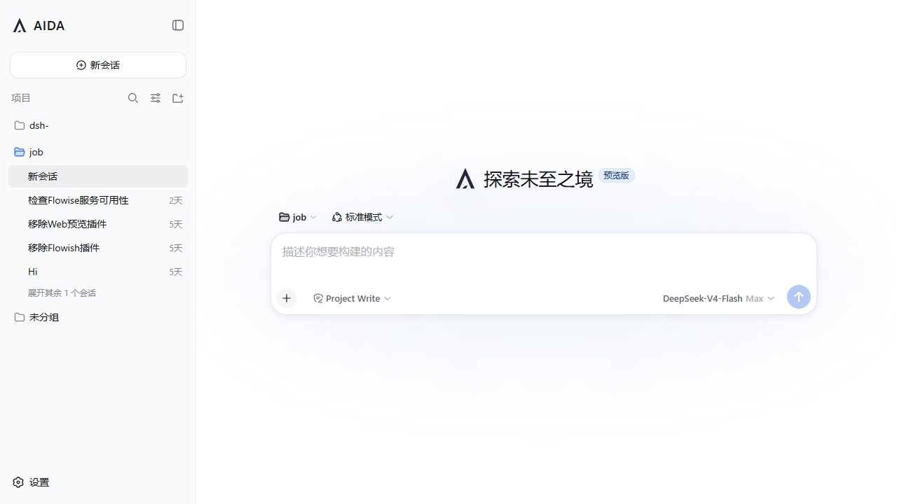
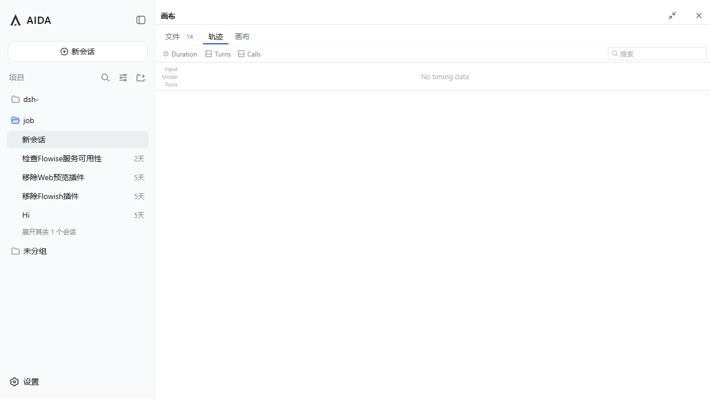

# 主题展示与集成验证

本章展示 AIDA UI 在 DSH Web 中的实际运行效果。截图基于 DSH `main`
提交 `141eb6fef83422698aef7a981029e843e8161534`，由本地集成环境直接采集。

## 1. AIDA 工作区总览

总览界面覆盖以下主题接管点：

- 侧边栏 AIDA 品牌标识和项目化文案。
- 会话首屏品牌标识、标语和输入区域。
- 与主会话并列的右侧 Canvas 工作区。
- 统一的强调色、边框、背景层级和交互状态。

## 2. Canvas 轨迹主题

轨迹子页面直接复用 DSH 的 `@deepseek-ai/dsh-client-ui-trajectory` 中的 `TrajectoryView`。AIDA UI 只调整页面入口和承载容器，不在插件中重新开发、定制或维护轨迹页面的分叉实现。

轨迹视图把 Agent 步骤详情放入 Canvas，保留工具调用、生成文件和步骤输出的上下文，
避免在主会话中重复展示完整轨迹。

## 3. Canvas 最大化主题

最大化状态用于长文档、代码、图表和 Office 文件预览。主题在宽屏工作区中继续保持
品牌色、面板层级和可读性的一致性。

## 4. 主题设计原则

- `品牌一致`：侧边栏、首屏和 Canvas 使用同一套 AIDA 标识与语义色。
- `内容优先`：主题不改变 DSH 的会话模型，只替换品牌和工作区呈现。
- `渐进增强`：插件卸载后，DSH 原有 UI 和行为可以恢复。
- `明暗适配`：颜色通过主题 token 注入，跟随 DSH 的 light、dark 和 system 偏好。
- `插件边界`：Workspace 文件能力经插件自己的 host API 提供，不要求修改 DSH 核心 RPC。

CANVAS 的文件、轨迹与画布预览页使用同一工具栏基线：`40px` 高度、`12px` 标签、`14px` 图标、`26px` 紧凑按钮、`28px` 搜索与导入控件。完整规范见 [AIDA UI 设计语言](./design-language.md)。

## 5. 集成验证范围

- AIDA host/client 双入口能够构建。
- AIDA 品牌插槽在 DSH `master` 中生效。
- Canvas 文件、轨迹和最大化视图能够真实渲染。
- Workspace 文件列表能够通过独立插件 API 加载。
- 插件 TypeScript 编译及定向测试通过。

## 6. 延伸材料

产品背景、Cordis、Everything is Plugin 和 2B/2C 思考见
[AIDA / DSH Slides](./slides/SLIDES.md)。

实现维护规则和 TASTE、Amicro 技能使用方式见项目根目录的
[`AGENTS.md`](../AGENTS.md)。
